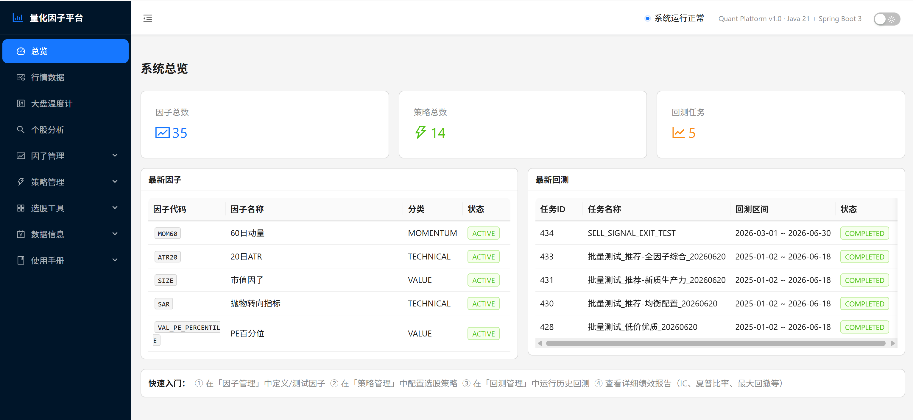
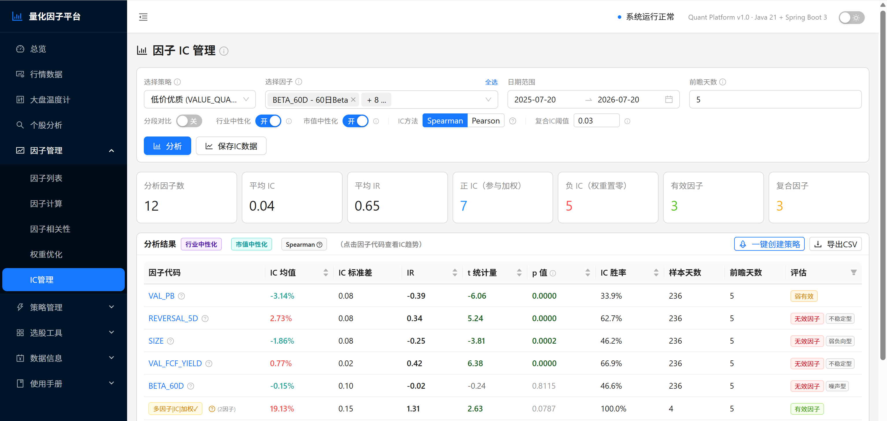
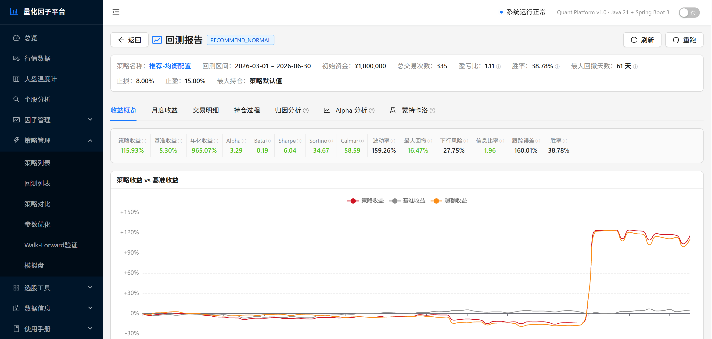
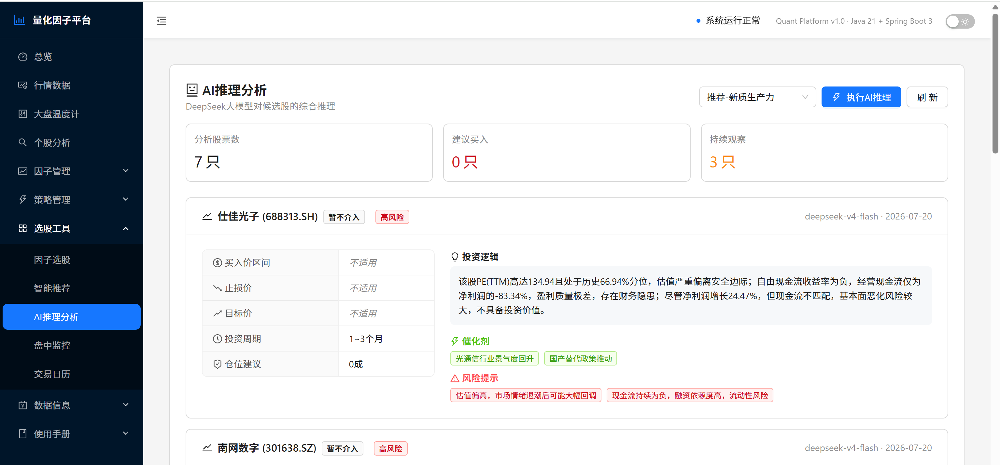
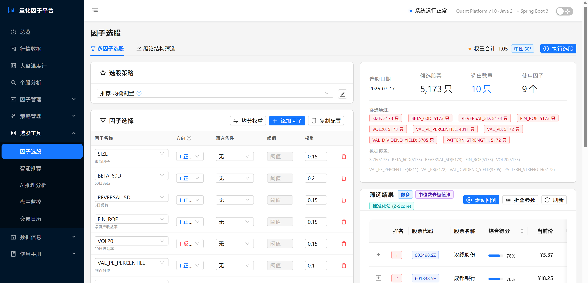
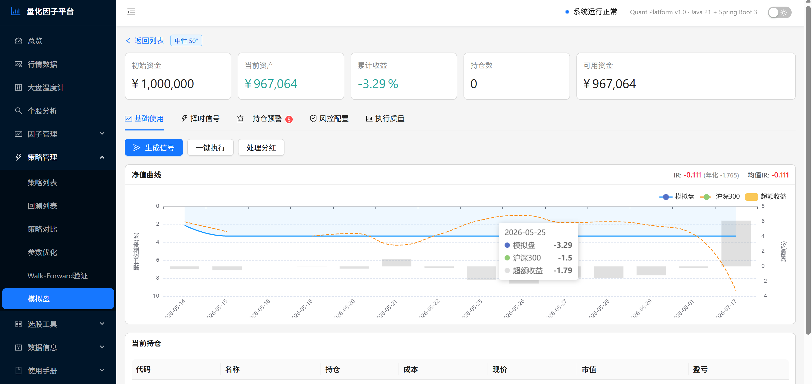
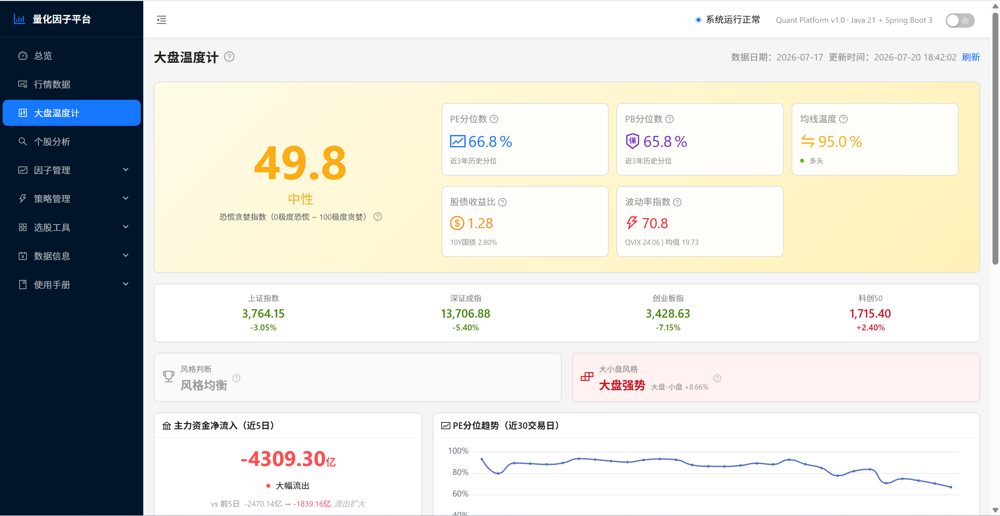
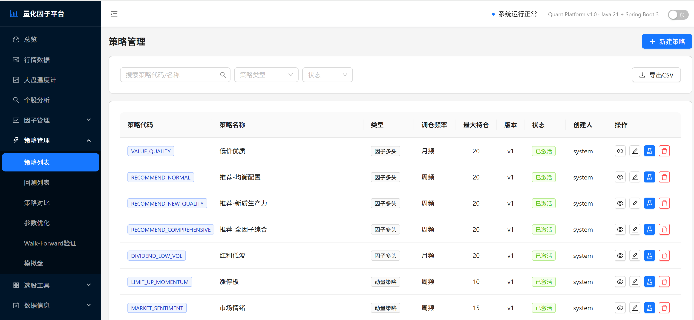
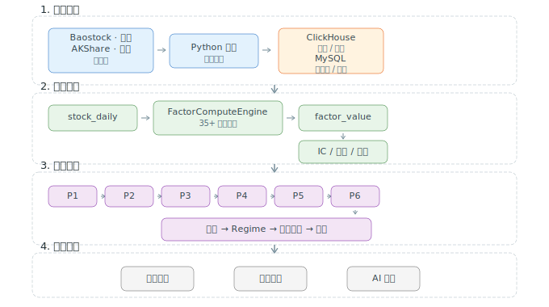

# 🎯 Quant Platform — 智能量化因子策略平台

[](https://adoptium.net/)
[](https://spring.io/projects/spring-boot)
[](https://react.dev/)
[](https://baomidou.com/)
[](https://clickhouse.com/)
[](https://dev.mysql.com/)
[](./LICENSE)
[](./CONTRIBUTING.md)

> **从因子挖掘到 AI 辅助决策，一站式 A 股量化投研平台。**  
> 覆盖 5000+ 全市场股票，35+ 精选因子，14 套策略，P1-P6 智能推荐管线。

---

## 📌 平台简介

### 这是什么？

Quant Platform 是一个**企业级 A 股量化投研一体化平台**，将因子挖掘、策略构建、回测验证、AI 辅助分析和模拟交易打通成完整闭环。不同于只能回测的工具，它覆盖了从**原始行情数据采集**到**每日选股推荐产出**的全链路——你给策略，它给答案。

### 能做什么？

| 能力域 | 具体功能 |
|--------|---------|
| **因子研究** | 35+ 内置因子（动量/价值/质量/情绪/资金/形态），IC 分析、衰减检测、相关性去冗余、权重优化、全生命周期管理 |
| **策略构建** | 14 套 ACTIVE 策略，多因子选股、动量、均值回归、形态识别、自定义脚本，置信度 P0-P3 冷启动保护 |
| **回测验证** | 事件驱动模拟、Brinson 归因、Fama-French 3 因子、蒙特卡洛 VaR/CVaR、Walk-Forward 防过拟合、参数网格搜索 |
| **智能推荐** | P1-P6 六阶管线（IC 筛选→半衰期→拥挤度→季频校正→一致性→ICW 融合），每日自动产出选股推荐 |
| **AI 分析** | DeepSeek 大模型驱动，个股因子画像、财务诊断、风险预警一键生成 |
| **组合风控** | 跨策略个股去重、SW2 行业集中度硬上限、回撤监控、Regime 市场状态自适应 |
| **模拟交易** | 信号生成→执行→风控→预警完整闭环，盘中实时监控，SSE 推送 |
| **数据工程** | 5 源采集（Baostock/腾讯/AKShare/东方财富/同花顺），ClickHouse 列存加速，前复权自动刷新 |

### 📸 截图预览

> 一图胜千言。以下截图展示了平台的实际运行界面，完整画廊见 [`screenshots/`](./screenshots/README.md)。

| Dashboard 总览 | 因子 IC 分析 | 回测报告 | AI 智能分析 |
|:---:|:---:|:---:|:---:|
|  |  |  |  |

| 选股器 | 模拟盘监控 | 市场温度计 | 策略列表 |
|:---:|:---:|:---:|:---:|
|  |  |  |  |

### 目标用户

| 用户群体 | 核心痛点 | 平台价值 |
|---------|---------|---------|
| **个人量化投资者** | 因子库匮乏、回测工具单一、无法系统评估策略 | 开箱即用的 35+ 因子 + 企业级回测引擎，降低量化门槛 |
| **量化研究团队** | 因子管理混乱、策略迭代慢、缺乏健康监控体系 | 因子全生命周期管理 + 衰减自动检测，研究效率倍增 |
| **金融科技公司** | 从零搭建量化系统成本高、数据管道维护难 | 完整数据工程链路 + 可扩展因子引擎，缩短产品化周期 |
| **量化学习者** | 理论与实践脱节，缺乏可运行的真实系统 | 完整开源代码 + 策略文档，从阅读到实操无缝衔接 |

### 核心价值主张

```
传统方式                          Quant Platform
──────────────────────────────────────────────────────
手动收集行情数据         →        5 源自动采集 + 前复权刷新
Excel 算因子 IC          →        35+ 因子一键计算 + 衰减检测
策略只看收益率            →        Brinson 归因 + FF3 + Monte Carlo
靠经验选股                →        P1-P6 管线 + 置信度系统
人工盯盘风控              →        组合风控自动巡检 + Regime 自适应
拍脑袋写分析报告           →        DeepSeek AI 一键生成诊断
```

---

## ✨ 为什么选择 Quant Platform？

<table>
<tr>
<td width="50%">

### 🔬 多因子引擎 — 不只是算 IC
- **35+ 精选因子**：动量、价值、质量、情绪、资金面、形态识别六大类
- **P1-P6 推荐管线**：IC 筛选 → 半衰期 → 拥挤度 → 季频校正 → 一致性 → ICW 上限 35%
- **因子健康监控**：自动衰减检测 → 降级 → 复活，每日 22:00 自动巡检
- **权重优化**：等权 / Markowitz 有效前沿 / 风险平价三种方法
- **相关性分析**：60 日滚动相关矩阵 + Union-Find 聚类去冗余

</td>
<td width="50%">

### 🤖 AI 驱动分析 — DeepSeek 大模型加持
- 个股深度分析：因子画像 + 财务诊断 + 现金流质量一键生成
- 多维度交叉验证：估值 / 成长 / 质量 / 动量四维综合评分
- 自然语言交互：输入股票代码，获得结构化的 AI 分析报告
- 置信度系统 P0-P3：冷启动保护，小样本自动降权

</td>
</tr>
<tr>
<td width="50%">

### 📊 企业级回测 — 不止看收益
- **事件驱动引擎**：历史模拟，手续费 + 滑点，真实还原交易成本
- **Brinson 归因**：配置效应 + 选股效应 + 交互效应三维拆解
- **Fama-French 3 因子**：市场 / 规模 / 价值风险暴露分析
- **蒙特卡洛模拟**：Bootstrap 200~1000 次，VaR/CVaR 尾部风险量化
- **Walk-Forward 优化**：滚动窗口验证，避免过拟合
- 净值曲线 / 回撤曲线 / 月度收益 / 交易记录全维度展示

</td>
<td width="50%">

### 🛡️ 组合风控 — 量产前的最后防线
- **跨策略个股去重**：多策略共同推荐时自动检测重叠
- **行业集中度监控**：SW2 二级行业分类，单行业敞口硬上限
- **回撤监控**：实时回撤预警，触发阈值自动降仓
- **Regime 检测**：市场状态自适应，牛熊切换动态调权
- **模拟盘交易**：信号生成 → 执行 → 风控 → 预警完整闭环

</td>
</tr>
</table>

---

## 🏗️ 技术架构

### 整体架构

```
┌──────────────────────────────────────────────────────────────┐
│                      React 18 前端                             │
│   Dashboard │ 因子管理 │ 策略管理 │ 回测分析 │ AI 分析        │
│   模拟交易 │ 选股器 │ 监控大盘 │ 日历 │ 财务数据             │
├──────────────────────────────────────────────────────────────┤
│                    Spring Boot 3.2 后端                        │
│  ┌──────────┬──────────┬──────────┬──────────┬─────────────┐  │
│  │ 因子引擎  │ 策略引擎  │ 回测引擎  │ 推荐引擎  │ LLM 分析    │  │
│  │ 35+因子   │ 14套策略  │ 事件驱动  │ P1-P6管线 │ DeepSeek    │  │
│  │ IC/衰减   │ 置信度P0-3│ Brinson   │ 因子健康  │ 个股诊断    │  │
│  │ 相关性    │ 形态识别  │ FF3/MC    │ 组合风控  │ 多维评分    │  │
│  └──────────┴──────────┴──────────┴──────────┴─────────────┘  │
│  ┌──────────┬──────────┬──────────┬──────────┬─────────────┐  │
│  │ 行情服务  │ 选股引擎  │ 模拟交易  │ 研报/财务 │ 交易日历     │  │
│  │ 多源采集  │ 黑名单过滤│ 信号/风控 │ 数据服务  │ 调度编排     │  │
│  └──────────┴──────────┴──────────┴──────────┴─────────────┘  │
├──────────────────────────────────────────────────────────────┤
│                        数据层                                  │
│  ┌──────────┬──────────┬──────────┬────────────────────────┐  │
│  │ MySQL 8  │ClickHouse│ Python   │    多源行情数据          │  │
│  │ 元数据    │ 因子值    │ 脚本引擎  │ Baostock·腾讯·AKShare  │  │
│  │ 策略配置  │ 日线数据  │ 数据采集  │   东方财富·同花顺       │  │
│  └──────────┴──────────┴──────────┴────────────────────────┘  │
└──────────────────────────────────────────────────────────────┘
```

### 功能模块关系

```
                           ┌─────────────┐
                           │  行情数据服务  │
                           │ MarketData  │
                           └──────┬──────┘
                                  │ K线/快照
                    ┌─────────────┼─────────────┐
                    ▼             ▼             ▼
             ┌────────────┐ ┌──────────┐ ┌────────────┐
             │  因子引擎   │ │ 选股引擎  │ │  情绪服务   │
             │ FactorSvc  │ │ScreenSvc │ │SentimentSvc│
             └─────┬──────┘ └────┬─────┘ └────────────┘
                   │              │
      ┌────────────┤              │
      ▼            ▼              │
┌──────────┐ ┌──────────┐        │
│ IC分析   │ │ 因子健康  │        │
│FactorIc  │ │HealthMon │        │
└────┬─────┘ └────┬─────┘        │
     │             │ 降级/复活     │
     │     ┌───────▼──────────┐   │
     │     │ FactorStatusEvent│   │
     │     └───────┬──────────┘   │
     │             │ 缓存刷新       │
     ▼             ▼              ▼
  ┌──────────────────────────────────┐
  │         推荐引擎 Recommendation    │
  │  P1:IC筛选 → P2:半衰期 → P3:拥挤度 │
  │  → P4:季频校正 → P5:一致性         │
  │  → P6:ICW融合(上限35%)            │
  └──────────┬───────┬───────────────┘
             │       │
     ┌───────▼──┐  ┌─▼──────────┐
     │ 组合风控   │  │ 置信度P0-3  │
     │PortfolioRk│  │Confidence  │
     └──────────┘  └────────────┘
             │
     ┌───────┼───────────────┐
     ▼       ▼               ▼
┌─────────┐ ┌──────────┐ ┌──────────┐
│ 回测引擎  │ │ 模拟交易   │ │ AI 分析   │
│Backtest │ │PaperTrad │ │ LLM Svc  │
└─────────┘ └──────────┘ └──────────┘
```

**关键依赖说明**：

| 上游模块 | 下游模块 | 交互内容 |
|---------|---------|---------|
| 行情服务 | 因子引擎 | 提供日线 K 线、实时快照用于因子计算 |
| 行情服务 | 推荐引擎 | 提供指数行情用于 Regime 市场状态检测 |
| 因子引擎 | 推荐引擎 | 提供因子值 + IC 记录 + 相关性矩阵 |
| 因子引擎 | 回测引擎 | 提供历史因子值用于策略信号回测 |
| 因子引擎 | 模拟交易 | 提供 ACTIVE 因子用于实时信号生成 |
| 因子健康 | 因子引擎 | 降级因子排除出计算队列，复活后恢复 |
| 策略引擎 | 推荐引擎 | 提供策略定义 + 因子权重配置 |
| 策略引擎 | 回测引擎 | 提供策略参数 + Groovy 脚本信号源 |
| 推荐引擎 | AI 分析 | 提供候选股池 + 因子画像作为 LLM 输入 |
| 推荐引擎 | 模拟交易 | 提供每日推荐作为模拟盘入场信号 |
| 回测引擎 | 模拟交易 | 导入风控参数（止损/止盈/最大回撤） |

### 端到端数据流



> **数据流说明**：5 源行情 → Python 采集 → ClickHouse/MySQL → FactorComputeEngine 批量计算 → IC/衰减/相关性分析 → P1-P6 推荐管线（选股/Regime/风控）→ 回测/模拟/AI 三条消费线。

### 定时任务依赖链

```
每日收盘后自动执行（ScheduleService 编排）：

DATA_FRESHNESS ─→ DAILY(行情采集) ─→ QFQ_REFRESH(前复权刷新)
                                          │
                                          ▼
                                    FACTOR_COMPUTE(因子计算)
                                          │
                          ┌───────────────┼───────────────┐
                          ▼               ▼               ▼
                   BIDASK(买卖盘)   RECOMMENDATION    FACTOR_HEALTH_CHECK
                                   _TRACK(推荐跟踪)    (22:00 因子健康巡检)
                                          │
                                          ▼
                                  DAILY_RECOMMENDATION
                                  (每日推荐生成+组合风控)
```

- 任务从 `data_schedule_config` 表加载，支持 cron 表达式
- 依赖关系从 `data_task_dependency` 表加载，`triggerDependents` 按延迟触发下游
- 支持 `require_all_upstreams` 多上游门控（所有上游完成才触发）

---

## 🚀 快速启动

### 环境要求

| 依赖 | 版本 | 说明 |
|------|------|------|
| Java | 21+ | [Temurin 21](https://adoptium.net/) |
| Maven | 3.8+ | 后端构建 |
| Node.js | 18+ | 前端开发 |
| MySQL | 8.0+ | 元数据存储 |
| ClickHouse | 24.x+ | 时序数据存储（可选，可用 MySQL 替代） |
| Python | 3.13+ | 数据采集脚本 |

### 1. 启动后端

```bash
# 编译
mvn clean package -DskipTests

# 启动
java -jar backend/target/backend-1.0.0.jar
```

后端地址：`http://localhost:8080/api` | Swagger：`http://localhost:8080/api/swagger-ui.html`

### 2. 启动前端

```bash
cd frontend
npm install
npm start
```

前端地址：`http://localhost:3000`

### 3. 数据库初始化

```sql
CREATE DATABASE stock CHARACTER SET utf8mb4 COLLATE utf8mb4_unicode_ci;
```

系统启动后自动建表，无需手动执行 DDL。

---

## 🧩 核心模块

### 📈 因子引擎

```
35+ ACTIVE 因子，覆盖 6 大类别
┌────────────┬─────────────────────────────────────────┐
│ 动量类      │ MOM5/20/60, LIMIT_UP_COUNT              │
│ 价值类      │ VAL_PE_PERCENTILE, VAL_PB, DIVIDEND_YIELD│
│ 质量类      │ FIN_ROE, FIN_NET_PROFIT_YOY, EARNINGS   │
│ 情绪/资金   │ VOLUME_RATIO, MARGIN_BUY_RATIO          │
│ 波动/换手   │ VOL20, TURNOVER_ANOMALY                 │
│ 形态识别    │ 6 个 PATTERN 伪因子（头肩顶底等）        │
└────────────┴─────────────────────────────────────────┘
```

- **IC 分析**：IC 序列、ICIR、RankIC、分层回测、多空收益
- **衰减分析**：有效期、半衰期、衰减系数 λ、拟合优度 R²
- **噪声过滤**：|IC| < 0.015 直接剔除
- **因子状态**：DRAFT → TESTING → ACTIVE → DEGRADED → DEPRECATED 全生命周期管理

### 🎯 推荐管线（P1-P6）

```
P1: IC 筛选     → 剔除噪声因子（|IC| < 0.015）
P2: 半衰期      → 预测能力持续性评估
P3: 拥挤度      → 因子拥挤风险预警
P4: 季频校正    → 财报季因子表现调整
P5: 一致性      → 多周期信号一致性验证
P6: ICW 融合    → IC 加权，上限 35%，反转有害因子
```

### 🧠 AI 智能分析

集成 **DeepSeek** 大语言模型，提供：
- 📋 **个股因子画像**：多维因子得分雷达图 + 文字解读
- 💰 **财务诊断**：营收、利润、ROE、现金流质量深度分析
- ⚠️ **风险提示**：估值过热、盈利下滑、现金流异常自动预警
- 🔄 **对比分析**：同行业个股横向对比

### 📊 回测引擎

| 功能 | 说明 |
|------|------|
| 事件驱动模拟 | 日频调仓，手续费万三 + 滑点 0.1% |
| 绩效指标 | 年化收益、最大回撤、Sharpe、Sortino、Calmar、IR、胜率 |
| Brinson 归因 | 配置效应 + 选股效应 + 交互效应 |
| FF3 分析 | 市场 β、规模 SMB、价值 HML 暴露 |
| Monte Carlo | 200~1000 次 Bootstrap，VaR/CVaR/置信区间 |
| Walk-Forward | 滚动窗口验证，防过拟合 |
| 参数优化 | 网格搜索，Sharpe / 年化 / Calmar 三目标 |

### 🔒 风险控制

- **组合风控**：跨策略个股去重 + SW2 行业集中度硬上限 + 回撤监控
- **Regime 检测**：市场状态自适应，牛市积极 / 熊市防御
- **模拟盘**：信号生成 → 执行 → 预警完整链路
- **黑名单过滤**：ST 股、风险警示股自动排除

---

## 📡 数据源

| 数据源 | 覆盖 | 用途 |
|--------|------|------|
| **Baostock** | 沪深全市场 | 日线行情、财务数据、分红除权 |
| **腾讯证券** | 沪深 + 北交所 | 实时行情、K 线数据 |
| **AKShare** | 全市场 | 情绪指标、资金流向、宏观经济 |
| **东方财富** | 全市场 | 研报、新闻、财务数据 |
| **同花顺** | 全市场 | 热点板块、龙虎榜、解禁数据 |

---

## 🗂️ 项目结构

```
quant-platform/
├── backend/                     # Spring Boot 3 后端
│   ├── factor/                  # 因子引擎（计算/测试/衰减/健康/权重优化）
│   ├── strategy/                # 策略引擎（选股/信号/置信度）
│   ├── backtest/                # 回测引擎（Brinson/FF3/MC/Walk-Forward）
│   ├── recommendation/          # 推荐管线 P1-P6 + 组合风控
│   ├── llm/                     # DeepSeek AI 分析
│   ├── market/                  # 行情数据服务
│   ├── screen/                  # 股票筛选器
│   ├── monitor/                 # 模拟盘监控
│   ├── financial/               # 财务数据
│   ├── research/                # 研报数据
│   ├── calendar/                # 交易日历
│   └── scripts/                 # Python 数据采集脚本
├── frontend/                    # React 18 前端
│   └── src/pages/
│       ├── Dashboard.js         # 系统总览
│       ├── factors/             # 因子管理
│       ├── strategies/          # 策略管理
│       ├── backtest/            # 回测分析
│       ├── llm/                 # AI 分析
│       ├── recommendation/      # 每日推荐
│       ├── screen/              # 选股器
│       ├── monitor/             # 监控大盘
│       ├── market/              # 行情数据
│       ├── datadetail/          # 数据详情
│       └── calendar/            # 交易日历
├── common/                      # 公共模块
├── docs/                        # 策略文档
└── scripts/                     # 运维脚本
```

---

## 📖 更多文档

| 文档 | 说明 |
|------|------|
| [docs/多因子选股策略.md](docs/多因子选股策略.md) | 多因子 Alpha / FF3 / 打分法策略详解 |
| [docs/量化择时策略.md](docs/量化择时策略.md) | 趋势跟踪 / 均值回归择时方案 |
| [docs/形态策略.md](docs/形态策略.md) | 头肩顶底 / 双底杯柄等形态识别 |
| [docs/技术指标策略.md](docs/技术指标策略.md) | MACD / RSI / 布林带策略集 |
| [docs/大师策略.md](docs/大师策略.md) | 经典量化策略复现 |
| [docs/低价优质股-完整操作方案.md](docs/低价优质股-完整操作方案.md) | 低价优质股选股操作指南 |

---

## ⚠️ 免责声明

本平台仅供量化投资研究与学习使用，不构成任何投资建议。所有回测结果均为历史数据模拟，不代表未来表现。投资有风险，入市需谨慎。

---

<p align="center">
  <b>Quant Platform</b> — Build. Test. Trade. Smarter.
</p>
