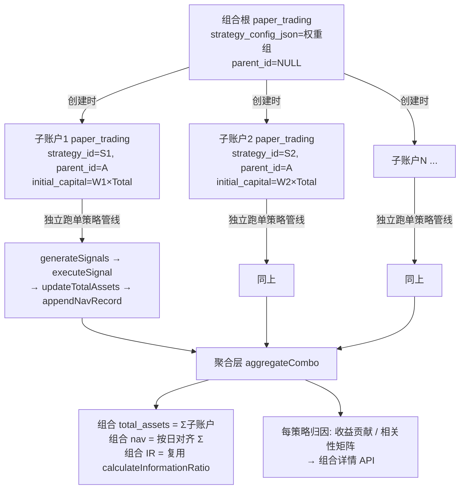

# 多策略组合 v1.2 —— Route B 架构设计（子账户聚合）

> 本文档取代 `multi-strategy-combo-v1.2-plan.md` 中"推荐 Route A"的结论。
> 经评估：**不考虑成本约束时，Route B（子账户聚合）才是多策略组合应有的架构**——
> 它直接交付 v1.2 的核心诉求"组合层面的资金分配"，且让"每策略 P&L / 相关性 / 归因"成为原生能力，而非事后近似。

---

## 1. 设计决策：子账户 = 一条真实的 `paper_trading` 子记录

核心洞察（基于现有代码盘点）：

- `paper_trading` 已是完整的"一个策略的账户"载体：自带 `initial_capital` / `current_capital` / `total_assets`、`strategy_id`、`strategy_config_json`、状态机、风控配置、净值表、信号/持仓。
- `paper_position` 已带 `strategy_id`（Phase 1 已加），`paper_signal` 同理。
- `PaperAccountService` 的 `updateTotalAssets` / `appendNavRecord` / `calculateInformationRatio` **全部按 `paper_id` 计算**，天然支持"每子账户独立核算"。

因此 **Route B 不需要新造"子账户"概念**，而是：

> **每个子策略 = 一条 `paper_trading` 子记录（`parent_id` 指向组合根）。**
> 组合根本身不交易、不持仓，仅做聚合；子账户各自独立跑完整单策略管线。

这带来三个不可替代的收益（Route A 做不到）：

| 能力 | Route A（融合） | Route B（子账户） |
|------|------|------|
| 资金真按策略切分 | ❌ 一把分选股 | ✅ 每子账户 `initial_capital = 组合资本 × 策略权重` |
| 每策略独立 P&L | ❌ 融合后不可分 | ✅ 子账户自带 nav / 持仓 / 现金流 |
| 策略间相关性 | ❌ 需影子回测近似 | ✅ 子账户 nav 序列直接算 |
| 单策略独立暂停/再平衡 | ❌ 只能整体动 | ✅ 改子账户状态即可 |
| 评估体系（L1/L2） | 需 hack | 原生 |

---

## 2. 架构总览



**关键：调度器对组合根不再调用 `generateSignals`，而是分发到各子账户跑标准单策略管线。** 现有 `PaperSignalGenerator` / `PaperOrderExecutionService` / `PaperAccountService` 几乎零改动即可复用。

---

## 3. 数据模型变更（最小化）

新增**仅一列**：

```sql
-- 组合父子关系（组合根 parent_id=NULL；子账户指向根）
ALTER TABLE paper_trading
  ADD COLUMN parent_id BIGINT NULL COMMENT '组合父盘ID；NULL=单策略或组合根',
  ADD INDEX idx_paper_parent (parent_id);
```

复用既有字段即可表达全部语义，无需新表：

| 字段 / 表 | 单策略盘 | 组合根 | 子账户 |
|------|------|------|------|
| `parent_id` | NULL | NULL | = 组合根 id |
| `strategy_id` | 本策略 id | NULL（或主策略） | 本子策略 id |
| `strategy_config_json` | NULL | `[{strategyId,weight},...]` | NULL |
| `initial_capital` | 自有 | = Σ 子账户之和 | = 组合资本 × 权重 |
| `current_capital` / `total_assets` | 自有 | = Σ 子账户 | 自有 |
| `paper_nav` | 自有 nav | 聚合写入 | 子账户自有 nav |
| `paper_position` | 自有 | 无（聚合视图） | `strategy_id` 标记 |
| `paper_risk_config` | 自有 | 组合级（可选） | 每子账户独立（含 `rebalance_freq`/`threshold`） |

> **`paper_rebalance_log`** 沿用 Phase 1 的 `v1.2_paper_combo.sql`（已定义但未执行），记录每子账户再平衡事件。

---

## 4. 关键流程

### 4.1 组合创建（扩展 `/create`）

1. 解析 `strategyConfigJson` = `[{strategyId, weight}, ...]`，校验权重和 ≈ 1.0（已有逻辑）。
2. 创建**组合根** `paper_trading`：`strategy_config_json` 写入，`initial_capital = 用户输入总资本`，`parent_id = NULL`，`status = RUNNING`。
3. 对每个策略条目，创建**子账户** `paper_trading`：
   - `parent_id = 根.id`，`strategy_id = 条目.strategyId`
   - `initial_capital = 总资本 × weight`（末位补足取整误差，保证 Σ = 总资本）
   - `strategy_config_json = NULL`（按单策略跑）
   - 复制/生成该子账户的 `paper_risk_config`（可继承组合级默认值，再按策略覆盖 `rebalance_freq`/`threshold`）
4. 返回组合根 id。

### 4.2 调度分发（改 `PaperTradingScheduler`）

顶层循环只处理 `parent_id IS NULL` 的运行盘：

```text
for pt in running papers where parent_id is null:
    if pt.strategyConfigJson != null:        // 组合根
        for child in children(pt.id) where status=RUNNING:
            runSingleStrategyPipeline(child)  // 现有单策略全流程
        aggregateCombo(pt)                     // 聚合 + 写组合nav + IR
    else:
        runSingleStrategyPipeline(pt)          // 普通单策略
```

`runSingleStrategyPipeline` = 现有 `generateSignals → executeSignal → updateTotalAssets → appendNavRecord`，**完全复用，不改**。

> 注意：子账户本身也是 RUNNING 的 `paper_trading`，但被 `parent_id IS NULL` 过滤排除在顶层循环之外，避免双重处理。

### 4.3 聚合层 `aggregateCombo(comboRoot)`

- `combo.totalAssets = Σ child.totalAssets`
- `combo.currentCapital = Σ child.currentCapital`
- `combo.positionCount = Σ child.positionCount`
- **组合净值序列**：以各子账户 `paper_nav` 为输入，按 `nav_date` 对齐（缺失日向前填充），`combinedTotalAssets(date) = Σ child.totalAssets(date)`；由此算 `dailyReturn` / `cumulativeReturn`，写入 `paper_nav(paper_id=root.id)`。
- **组合 IR**：直接复用 `PaperAccountService.calculateInformationRatio`，传入组合 nav 序列与基准。

### 4.4 每策略归因 / 评估（原生能力）

因每个子账户有独立 nav 序列，评估体系（见 v1.2-plan 第 10 节）全部天然可得，**不再需要影子回测**：

- **收益贡献**：`childContribution = (child.totalAssets − child.initialCapital) / combo.initialCapital`
- **相关性矩阵**：取各子账户日收益序列 → Pearson 相关系数矩阵（`ρ>0.7` 红灯）
- **分散化比率 DR**、**最优单策略基准对比**：直接由各子账户净值算出

### 4.5 每子账户再平衡（`PaperRebalanceService`）

- 每个子账户持独立 `paper_risk_config.rebalance_freq` / `rebalance_threshold`。
- 调度器在 `aggregateCombo` 后，逐子账户检查权重漂移（子账户内持仓市值占比 vs 目标），超阈值则触发再平衡，记录 `paper_rebalance_log`。
- 组合根可设统一再平衡（遍历子账户），也可仅对单个子账户手动触发。

---

## 5. 接口设计（Controller 扩展）

| 方法 & 路径 | 说明 |
|------|------|
| `POST /api/paper/combo/create` | 创建组合（根+子账户），body 含 `initialCapital` + `strategyConfigJson` |
| `GET /api/paper/combo/{id}/detail` | 组合总览：总资本/总收益/组合 nav/每策略贡献/相关性矩阵 |
| `GET /api/paper/combo/{id}/sub-strategies` | 子账户列表：各自 P&L、持仓数、状态 |
| `GET /api/paper/combo/{id}/nav?range=` | 组合与每子账户净值曲线（前端多线对比） |
| `POST /api/paper/combo/{id}/rebalance` | 触发组合再平衡（遍历子账户） |
| `POST /api/paper/combo/{id}/sub/{strategyId}/pause` | 暂停某子策略（状态→PAUSED，资金留在该子账户） |
| `POST /api/paper/combo/{id}/sub/{strategyId}/resume` | 恢复某子策略 |
| `POST /api/paper/combo/{id}/sub/{strategyId}/adjust-weight` | 调整权重（触发该子账户再平衡） |

---

## 6. 与 Route A 的差异 & Phase 1 兼容性

| 项 | Route A | Route B |
|------|------|------|
| 信号生成 | `generateSignals` 内融合多因子、Top-20 | 组合根**不调用** `generateSignals`；子账户各自单策略 |
| Phase 1 加的 `strategy_id` | 填组合自身 id（含义模糊） | 子账户 `strategy_id` = 真实子策略，**语义精确** |
| `paper_rebalance_log` | 同 | 同（复用） |
| 已写代码 | `PaperSignalGenerator` 融合分支 | 该分支对组合模式变为**死代码**（子账户走单策略路径） |

**Phase 1 工作全部保留、且语义更正确**：`strategy_id` 字段、`paper_signal`/`paper_position` 改动、`paper_rebalance_log` DDL 直接复用。仅需补 `paper_trading.parent_id` 一列。

清理项（可选，非阻塞）：组合根不再走融合分支后，`generateSignals` 内 `combinedFactorWeights` 的跨策略合并逻辑可删除，但保留亦无害（单策略盘本就不会触发）。

---

## 7. 分阶段实施计划

| Phase | 内容 | 改动面 | 估时 |
|------|------|------|------|
| **B0** | 加 `parent_id` 列 + 索引；执行 Phase1 遗留 DDL | 1 个 ALTER | 0.5d |
| **B1** | 组合创建：根+子账户孵化 + 权重校验 + 资本切分 | `PaperTradingController`/`Service` 新增 combo create | 2d |
| **B2** | 调度分发 + `aggregateCombo` 聚合 | `PaperTradingScheduler`、`PaperAccountService` 新增方法 | 3d |
| **B3** | 组合详情 API + 每策略归因/相关性 | 新增 Controller 接口 + 计算逻辑 | 3d |
| **B4** | `PaperRebalanceService` 每子账户再平衡 + 日志 | 新增 Service + 接入调度 | 3d |
| **B5** | 前端组合总览（4 Tab）+ 暂停/恢复/再平衡 | 前端 | 3-4d |

**合计 ≈ 14.5–15.5 人天（约 3 周）**。对比 Route A 的 9–12 人天，B 多 ~4 人天，但换来的是**真·组合管理能力**，而非近似。用户此前明确"不考虑成本"，故 B 为首选。

---

## 8. 风险点

1. **子账户资本取整**：权重 × 总资本需末位补差，保证 Σ = 总资本；否则组合根 `totalAssets` 与子账户和不一致。
2. **净值日期对齐**：子账户 nav 日期可能因停牌/数据缺失不齐，聚合需向前填充，避免组合 nav 跳变。
3. **暂停子账户的资金**：暂停后其现有持仓仍在、现金闲置；若需"资金回流组合"需额外处理，初版可先留闲置。
4. **调度幂等**：同一交易日重复跑聚合需 upsert（nav 按 `paper_id+nav_date` 唯一），现有 `appendNavRecord` 已具备更新逻辑，复用即可。
5. **组合根本身不交易**：其 `paper_position` 应为空；前端/统计需以"聚合视图"为准，避免误读根记录。

---

## 9. 结论

Route B 用一个 `parent_id` 字段 + "子账户即子记录"的约定，把多策略组合从"融合 hack"变成"账户树聚合"。它：
- 直接交付 v1.2 的资金分配诉求；
- 让评估体系（相关性/归因/分散化）成为原生能力，删掉影子回测这个权宜之计；
- 复用现有单策略全链路，新增代码集中在"孵化 / 分发 / 聚合 / 再平衡"四块，风险可控。

**建议立即按 B0→B5 推进，废弃 Route A 融合路线。**

---

## 10. 实现进度（2026-08-05 已完成后端 B0–B4）

| Phase | 内容 | 状态 | 落地位置 |
|------|------|------|---------|
| **B0** | `parent_id` 列 + 索引；`v1.2_paper_combo.sql` 合并为 Route B 唯一建表入口（修正过时注释）；`PaperRebalanceLog` 实体 + Mapper | ✅ 已完成 | `PaperTrading.parentId`、`v1.2_paper_combo.sql`、`PaperRebalanceLog.java` |
| **B1** | 组合创建：根(`parent_id=NULL`)+ N 子账户(`parent_id=根`,`initial_capital=总资本×权重`,末位补差)；各自建 nav + risk_config | ✅ 已完成 | `PaperTradingService.createPaperTrading`（组合分支 + `insertInitialNav`/`buildRiskConfig`/`lookupStrategyCode` 私有方法） |
| **B2** | 调度分发 + 聚合：顶层只跑 `parent_id IS NULL`；组合根分发子账户跑单策略管线后 `aggregateCombo` | ✅ 已完成 | `PaperTradingScheduler`（拆 `runSingleStrategyPipeline`/`runComboPipeline`）、`PaperAccountService.aggregateCombo`（nav 前向填充 + upsert）、`PaperTradingService.aggregateCombo`/`getComboChildren` |
| **B3** | 组合详情/归因 API：总览、子策略贡献、相关性矩阵(ρ)、分散化比率(DR)；nav 曲线；子策略暂停/恢复 | ✅ 已完成 | `PaperTradingService.getComboDetail`/`getComboSubStrategies`/`getComboNav`/`pauseSubStrategy`/`resumeSubStrategy` + Controller 端点 `/combo/{id}/detail`、`/sub-strategies`、`/nav`、`/sub/{sid}/pause`、`/sub/{sid}/resume` |
| **B4** | 再平衡引擎：子账户按 `rebalance_freq`/`threshold` 触发（THRESHOLD/周/月），旋转并记录 `paper_rebalance_log`；手动触发 + 调权重 | ✅ 已完成 | `PaperRebalanceService`（新建）、Scheduler 接入、Controller `/combo/{id}/rebalance`、`/sub/{sid}/adjust-weight` |
| **B5** | 前端组合总览（4 Tab：总览/子策略/再平衡历史/信号流水）+ 暂停/恢复/再平衡交互 | ✅ 已完成 | 前端 `frontend/src/pages/strategies/ComboTradingPage.js` + `PaperTradingPage.js`（创建弹窗组合模式/列表识别）、`frontend/src/api/index.js`（paperTradingApi 增 10 个 combo 方法） |
| **B5+** | 组合删除级联修复：`deletePaperTrading` 原仅删自身、因 `parent_id` 无外键约束导致子账户孤儿化；改为删除组合根时级联清理所有子账户（signal/position/nav/risk_config + 主表） | ✅ 已完成 | `PaperTradingService.deletePaperTrading`（`@Transactional` + `selectList(parent_id)` + `deleteBatchIds`） |

**编译验证**：`mvn -pl common,platform-core,stock-service -am package -DskipTests` → BUILD SUCCESS。

**需手动执行项（部署前必须）**：
1. 跑 `stock-service/sql/v1.2_paper_combo.sql`（建 `parent_id`、`strategy_id`、`paper_rebalance_log`）。
2. 因编译时占用了运行中的 8080 服务进程，部署前需先执行 DDL，再重启 stock-service。

**已知边界（Route B 固有，非缺陷）**：
- 组合根不交易、无持仓，仅聚合；前端/统计须以聚合视图为准。
- 暂停子账户后其现金闲置在子账户内，未回流组合（初版按 B 文档风险点 3 留闲置）。
- 再平衡引擎对 DAILY 频子账户跳过（由每日管线处理）；THRESHOLD/WEEKLY/MONTHLY 触发旋转并写日志，同日去重。
- Phase 1 遗留的 `PaperSignalGenerator` 因子融合分支在 Route B 下对组合模式为死代码（子账户走单策略路径），可后续清理，不阻塞。

**已修复缺陷（B5 期间发现）**：
- **组合删除孤儿化**：`parent_id` 仅建索引、无外键约束，原 `deletePaperTrading` 只删目标记录，删除组合根会遗留子账户孤儿行。已改为删除时级联清理所有 `parent_id=根` 的子账户（信号/持仓/净值/风控配置 + 主表，整体 `@Transactional`）。
- **前端 `paperTradingApi.create` 漏传 `strategyConfigJson`**：原签名只接收 4 个参数，组合创建 UI 调用的第 5 个参数（组合配置 JSON）被丢弃，导致组合创建走到单策略分支报错。已补齐第 5 参并放入请求 params（`frontend/src/api/index.js`）。

**构建注意（本机 Windows 沙箱）**：`mvn clean` 因 safe-delete shim / 文件锁会报「Failed to delete target」而 FAIL CLOSED；`shutil.rmtree` 也被同一 shim 拦截。解决：用 `ctypes.windll.kernel32.DeleteFileW/RemoveDirectoryW` 直接删 `common`/`platform-core`/`stock-service` 的 `target` 后，再跑 `mvn ... clean package`（此时 clean 无目录可删即成功，触发完整重建）。注意：直接 `mvn package`（不 clean）在 target 被外部删除后可能产出损坏的空 BOOT-INF fat jar，必须走 `clean package`。
